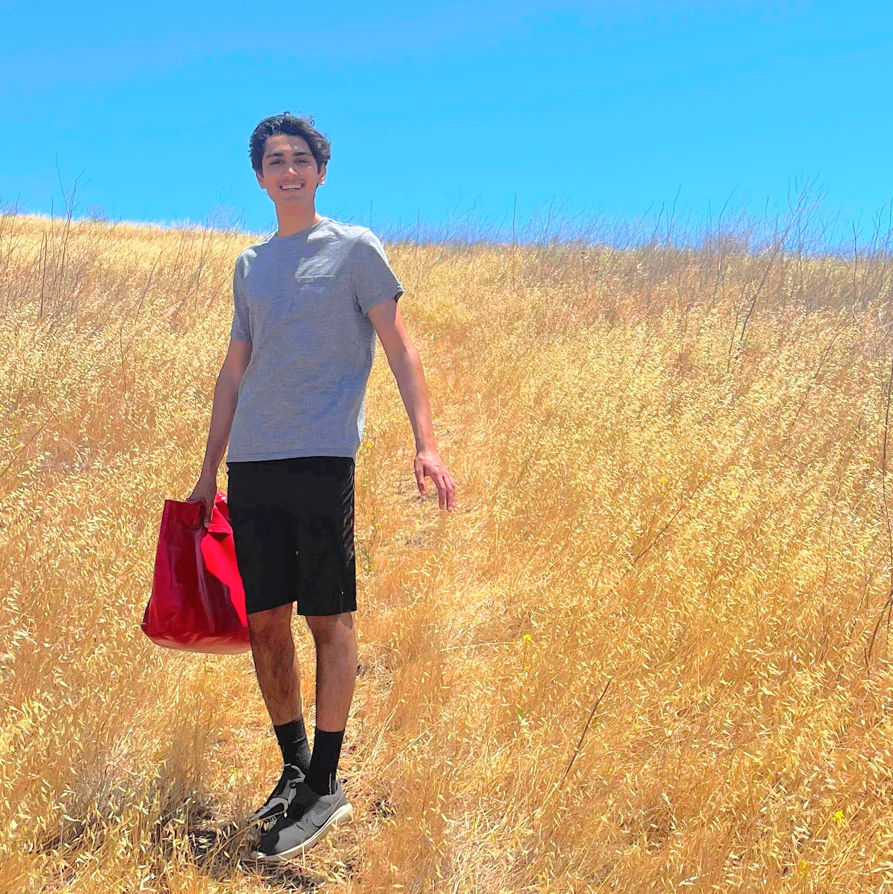

---
resume:
  url: assets/resume20230716.pdf
---

# Rijul Jain

 

I’m an undergraduate at [**Williams College**](https://www.williams.edu/) majoring in Computer Science and English. I’ll be a visiting student at the [**University of Oxford**](https://www.exeter.ox.ac.uk/) for the 2023-24 academic year. My background is in: programming language design and implementation; [text-to-visual](https://github.com/rjainrjain/PixelPunk) computing systems; Linux and its labyrinthine workings; probing the possibilities of literary criticism and theory going forward; [aesthetically innovative](https://catalog.williams.edu/2223/engl/detail/?strm=1231&cn=318&crsid=021029&req_year=23) [representations](https://catalog.williams.edu/2223/engl/detail/?strm=1233&cn=483&crsid=018164&req_year=0) of [history](https://catalog.williams.edu/2122/engl/detail/?strm=1223&cn=402&crsid=020281&req_year=22) in literature; and English literature of the nineteenth and twentieth centuries.

Currently, I'm exploring the intersection of **programming languages** and **human-computer interaction** at Carnegie Mellon University's [Research Experiences for Undergraduates (REUSE)](https://www.cmu.edu/scs/s3d/reuse/) program under [Joshua Sunshine](https://www.cs.cmu.edu/~jssunshi/) and [Keenan Crane](https://www.cs.cmu.edu/~kmcrane/), researching domain-specific program generation with large language models to democratize diagram authoring using [Penrose](https://penrose.cs.cmu.edu/). As part of [previous research](assets/bitfridge-poster.pdf) with [Daniel Barowy](http://www.cs.williams.edu/~dbarowy/) at Williams, I've also implemented a programming language that describes and captures UNIX filesystem state, sidestepping problems with breaking system call API changes to safely express program semantics for OS platform- and version-agnostic execution.

I'm also deeply invested in finding generative ways to reconcile the richness of the logics and interpretive modes of aesthetically daring [literature](https://www.ndbooks.com/book/the-rings-of-saturn/), [literary theory](https://thecharnelhouse.org/wp-content/uploads/2017/09/Fredric-Jameson-The-Antinomies-of-Realism-2015.pdf) and unconventional [philosophy](https://files.libcom.org/files/A%20Thousand%20Plateaus.pdf)[(?)](https://seansturm.files.wordpress.com/2012/06/benjamin-theses-on-the-philosophy-of-history.pdf) with our various computational models of (and subsequent assumptions about) the world. I hope to work with programming languages in a human-centered fashion, specifically informed by as well as reshaping such insights from the humanities.

[_résumé_]({{page.resume.url}}) | [_github_](https://github.com/rjainrjain) | [_linkedin_](https://www.linkedin.com/in/rijul-jn/) | [_arts column_](https://williamsrecord.com/staff_name/rijul-jain/) | [_email me!_](mailto:rijul.jain@williams.edu)
